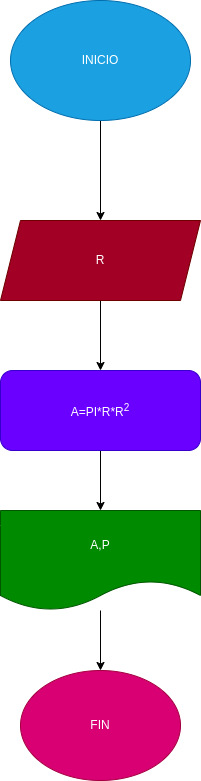

# Ejercio no.1

##programa para calcular el area y perimetro de un circulo de radio R

# ANALISIS 

Variables de entrada (imput)

R: Radio del circulo

Variable de proceso y salida (processing, storage, output)

A: Area del circulo
P: Perimetro del circulo 

# DISEÑO

# CONSTRUCCION

